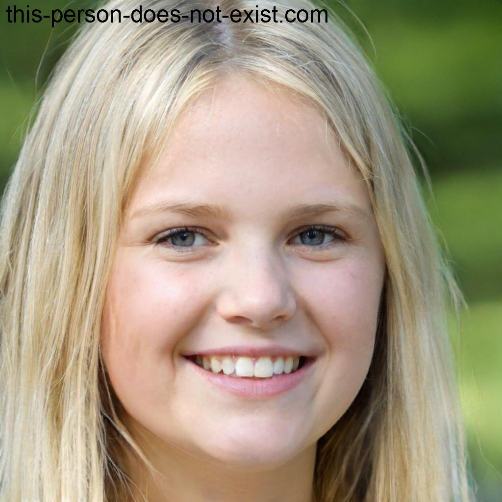

# ***Personas***

## **Introdução**

&emsp;&emsp; Neste documento você encontrará as personas criadas pelo grupo, juntamente com a metodologia empregada para defini-las. Ele oferece uma visão detalhada das personas desenvolvidas, incluindo suas características, motivações e necessidades. Através desse documento, você poderá compreender melhor o público-alvo, permitindo uma abordagem mais direcionada e eficaz para atender às necessidades dos usuários.

## **Metodologia**

&emsp;&emsp; Courage e Baxter, enfatizam a importância de ter um conjunto específico de personas para cada projeto. Recomenda-se ter de 3 a 12 personas. 
Para criar as personas utilizamos a técnica usada para coletar dados <a href="https://requisitos-de-software.github.io/2023.2-Jitsi/Elicita%C3%A7%C3%A3o/questionario/">questionário</a>, que a partir disso conseguimos elaborar o perfil de usuário.
As imagens utilizadas neste documento para reprensentar as personas foram obtidas do site <a href="https://this-person-does-not-exist.com/en">This Person Does Not Exist</a>, que a partir de inteligência artificial gera imagens que não possuem direitos autorais.

## **Personas**
### Marina Lima - Persona Primária

<figcaption align='center'>
    <b>Figura 01: Marina Lima - Persona Primária.</b>
     <small>Fonte: <a href='https://this-person-does-not-exist.com/en'>Thispersondoesnotexist</a> </small>
</figcaption>

 

| Característica       | Resposta                                                                                                                                              |
|:---------------------|:------------------------------------------------------------------------------------------------------------------------------------------------------|
| **Nome**             | Marina Lima                                                                                                                                             |
| **Idade**            | 23 anos                                                                                                                                               |
| **Gênero**           | Feminino                                                                                                                                              |
| **Localidade**       | São Paulo, Brasil                                                                                                                                     |
| **Particularidades** | Adora tecnologia e busca soluções para otimizar a comunicação em sua equipe de trabalho. Gosta de praticar yoga nas horas vagas.                      |
| **Escolaridade**     | Graduada em Administração                                                                                                                             |
| **Profissão**        | Gerente de Projetos em uma empresa de TI                                                                                                              |
| **História**         | Trabalha na área de tecnologia há 10 anos e está sempre em busca de ferramentas eficientes para otimizar a colaboração e a comunicação da sua equipe. |
| **Objetivos**        | Utilizar o Jitsi para reuniões diárias de acompanhamento de projetos e treinamentos com a equipe.                                                     |
| **Rotina**           | Ativa e focada em suas atividades profissionais, com reuniões frequentes e práticas de yoga para equilíbrio.                                          |
| **Requisitos**       | Alta qualidade de áudio e vídeo, integração com calendário e capacidade de compartilhamento de tela.                                                  |
| **Frequência**       | Diariamente.                                                                                                                                          |
| **Necessidades**     | erramenta de comunicação confiável e eficiente para coordenar equipes remotas.                                                                        |
| **Expectativas**     | Espera uma plataforma intuitiva e de fácil utilização que a ajude a manter sua equipe produtiva.                                                      |

<h6 align = "center"> Tabela 01: Persona Marina.
  Autore(a): <a href="https://github.com/CarolinaBarb">Carolina Barbosa</a> e <a href="https://github.com/BrunoHenrique00">Bruno Henrique</a></h6>

### Marcos Costa - Persona Primária

<figcaption align='center'>
    <b>Figura 02: Marcos Costa - Persona Primária.</b>
     <small>Fonte: <a href='https://this-person-does-not-exist.com/en'>Thispersondoesnotexist</a> </small>
</figcaption>

 

| Característica       | Resposta                                                                                                                   |
|:---------------------|:---------------------------------------------------------------------------------------------------------------------------|
| **Nome**             | Marcos Costa                                                                                                                   |
| **Idade**            | 25                                                                                                                         |
| **Gênero**           | Masculino                                                                                                                  |
| **Localidade**       | Mumbai, Índia                                                                                                              |
| **Particularidades** | Desenvolvedor de software freelancer, precisa de uma plataforma para reuniões com clientes e colaboradores remotos.        |
| **Escolaridade**     | Bacharelado em Ciência da Computação                                                                                       |
| **Profissão**        | Desenvolvedor de Software Freelancer                                                                                       |
| **História**         | Trabalha de forma independente e precisa de uma solução confiável para reuniões virtuais com clientes e colegas de equipe. |
| **Objetivos**        | Utilizar o Jitsi para reuniões de brainstorming e acompanhamento de projetos com clientes.                                 |
| **Rotina**           | Flexível, dependendo dos prazos e demandas de projetos.                                                                    |
| **Requisitos**       | Boa qualidade de áudio e vídeo, capacidade de compartilhar código e integração com ferramentas de desenvolvimento.         |
| **Frequência**       | Variável, dependendo dos projetos em andamento.                                                                            |
| **Necessidades**     | Ferramenta confiável para comunicação remota com clientes e colaboradores.                                                 |
| **Expectativas**     | Espera uma plataforma que permita uma colaboração eficaz em projetos de desenvolvimento de software.                       |

<h6 align = "center"> Tabela 02: Persona Marcos.
  Autores(a): <a href="https://github.com/CarolinaBarb">Carolina Barbosa</a> e <a href="https://github.com/BrunoHenrique00">Bruno Henrique</a></h6>

### Jaqueline Pereira - Persona Secundária

<figcaption align='center'>
    <b>Figura 03: Jaqueline Pereira - Persona Secundária.</b>
     <small>Fonte: <a href='https://this-person-does-not-exist.com/en'>Thispersondoesnotexist</a> </small>
</figcaption>

 

| Característica       | Resposta                                                                                                            |
|:---------------------|:--------------------------------------------------------------------------------------------------------------------|
| **Nome**             | Jaqueline Pereira                                                                                                         |
| **Idade**            | 38                                                                                                                  |
| **Gênero**           | Feminino                                                                                                            |
| **Localidade**       | Lisboa, Portugal                                                                                                    |
| **Particularidades** | Professora universitária que busca uma solução de videoconferência para aulas online e reuniões acadêmicas.         |
| **Escolaridade**     | Doutorado em Literatura Comparada                                                                                   |
| **Profissão**        | Professora Universitário                                                                                            |
| **História**         | Leciona há 15 anos e necessita de uma plataforma que permita interações fluidas com seus alunos, mesmo à distância. |
| **Objetivos**        | Utilizar o Jitsi para aulas online e reuniões com colegas e alunos.                                                 |
| **Rotina**           | Dedica grande parte do tempo ao ensino, pesquisa e orientação de estudantes de pós-graduação.                       |
| **Requisitos**       | Boa qualidade de vídeo e áudio, funcionalidade de chat e opção de gravação de aulas.                                |
| **Frequência**       | Três vezes por semana.                                                                                              |
| **Necessidades**     | Ferramenta confiável para aulas online interativas e produtivas.                                                    |
| **Expectativas**     | Espera uma plataforma estável e intuitiva que facilite a comunicação com seus alunos.                               |

<h6 align = "center"> Tabela 03: Persona Jaqueline.
  Autores(a): <a href="https://github.com/CarolinaBarb">Carolina Barbosa</a> e <a href="https://github.com/BrunoHenrique00">Bruno Henrique</a></h6>

### Isaque Oliveira - Anti-Persona

<figcaption align='center'>
    <b>Figura 04: Isaque Oliveira - Anti-Persona.</b>
     <small>Fonte: <a href='https://this-person-does-not-exist.com/en'>Thispersondoesnotexist</a> </small>
</figcaption>

 

| Característica       | Resposta                                                                                                                                                                                                                                     |
|:---------------------|:---------------------------------------------------------------------------------------------------------------------------------------------------------------------------------------------------------------------------------------------|
| **Nome**             | Isaque Oliveira                                                                                                                                                                                                                                       |
| **Idade**            | 55                                                                                                                                                                                                                                           |
| **Gênero**           | Masculino                                                                                                                                                                                                                                    |
| **Localidade**       | Belo Horizonte, Brasil                                                                                                                                                                                                                       |
| **Particularidades** | Isaque é um entusiasta da música clássica e, recentemente, se aposentou como professor de matemática.                                                                                                                                        |
| **Escolaridade**     | Mestrado em Matemática                                                                                                                                                                                                                       |
| **Profissão**        | Professor de Matemática aposentado                                                                                                                                                                                                           |
| **História**         | saque dedicou a maior parte de sua vida ao ensino de matemática em uma escola local. Agora aposentado, ele deseja explorar novas maneiras de se manter ativo intelectualmente e se conectar com sua família, que está espalhada pelo Brasil. |
| **Objetivos**        | Planeja aprender a tocar piano num estudio no centro que fica 45 min. da sua casa.  |
| **Rotina**           | Seu dia é flexível após a aposentadoria, permitindo-lhe dedicar tempo a seus hobbies, como ouvir música, ler sobre matemática e praticar jardinagem.                                                                                         |
| **Requisitos**       | Não encontrar transito no caminho da sua casa ao estudio onde fará suas aulas. |
| **Frequência**       | Duas vezes por semana para aulas de piano.     |
| **Necessidades**     | Aprender música clássica.         |
| **Expectativas**     | Manter envolvido em suas paixões e poder apresentar para sua familia seu novo talento. |

<h6 align = "center"> Tabela 04: Persona Isaque.
  Autores(a): <a href="https://github.com/CarolinaBarb">Carolina Barbosa</a> e <a href="https://github.com/BrunoHenrique00">Bruno Henrique</a></h6>

## **Histórico de Versão**

&emsp;&emsp;A tabela 05 representa o histórico de versão do documento.

| Versão | Data       | Descrição            | Autor(es)                                                                                                  | Revisor(es)                                 |
|--------|------------|----------------------|------------------------------------------------------------------------------------------------------------|---------------------------------------------|
| `1.0`  | 03/10/2023 | Criação do Documento | [Bruno Henrique](https://github.com/BrunoHenrique00) e [Carolina Barbosa](https://github.com/CarolinaBarb) | [Catlen Cleane](https://github.com/catlenc) |
| `1.1`  | 03/10/2023 | Iniciando Personas   | [Bruno Henrique](https://github.com/BrunoHenrique00) e [Carolina Barbosa](https://github.com/CarolinaBarb) | [Catlen Cleane](https://github.com/catlenc) |
| `1.2`  | 04/10/2023 | Finalizar Personas   | [Bruno Henrique](https://github.com/BrunoHenrique00) e [Carolina Barbosa](https://github.com/CarolinaBarb) | [Catlen Cleane](https://github.com/catlenc) |
| `1.3`  | 06/11/2023 | Ajustes após a entrega 2 | [Carolina Barbosa](https://github.com/CarolinaBarb) | [Júlia Souza](https://github.com/JuliaSSouza) |
| `1.4`  | 06/11/2023 | Correção de imagem| [Carolina Barbosa](https://github.com/CarolinaBarb) e [Júlia Souza](https://github.com/JuliaSSouza) | [Catlen Cleane](https://github.com/catlenc) |

<h6 align="center"> Tabela 05: Histórico de Versão.
  Autor(a): <a href="https://github.com/CarolinaBarb">Carolina Barbosa</a></h6>

## **Bibliografia**

> <a href="https://requisitos-de-software.github.io/2023.1-Simplenote/elicitacao/personas/">[1]</a> Personas Simplenote. Acesso em 06 de Novembro de 2023.