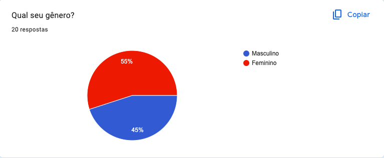
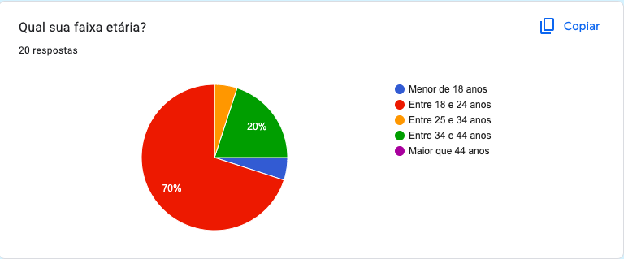
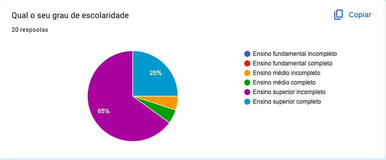
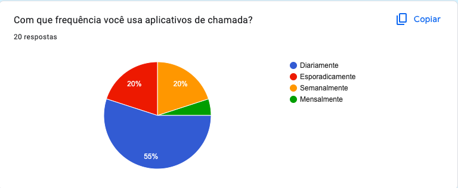
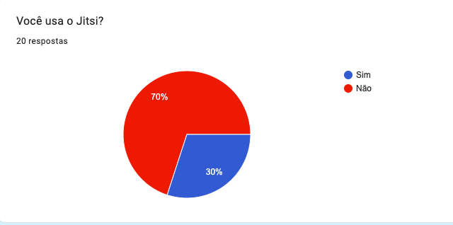
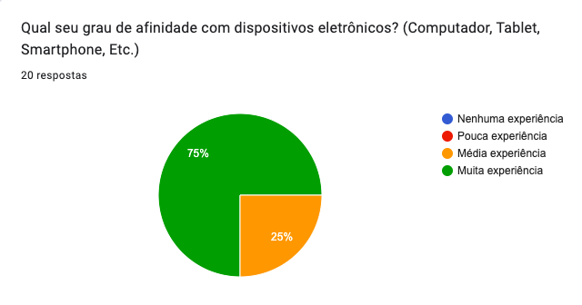
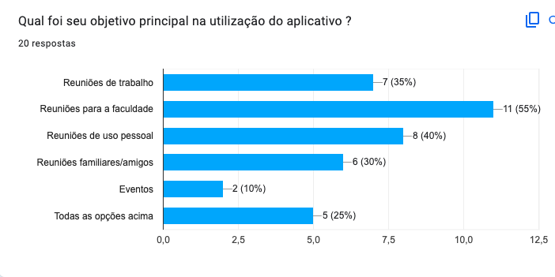
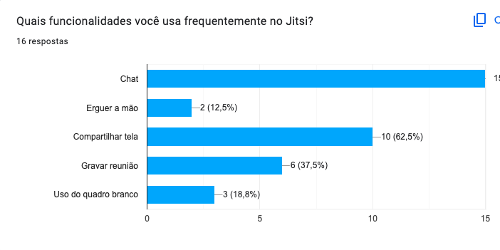
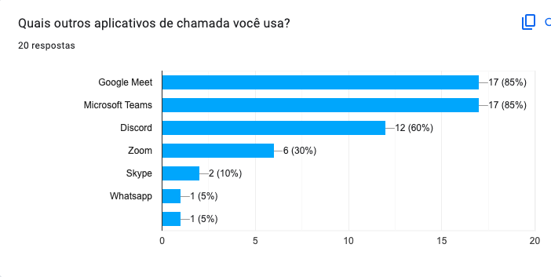

# ***Questionário***

## **Introdução**

&emsp;&emsp;Um questionário é uma técnica comum utilizada para a elicitação de requisitos, que envolve a criação de um conjunto de perguntas com o objetivo de coletar informações sobre as necessidades e expectativas de um grupo de pessoas. Ao utilizar um questionário, é possível obter dados de um grande número de pessoas de forma rápida e eficiente. Analisando as respostas dos questionários, é possível identificar padrões, tendências e preferências das partes interessadas, o que pode ajudar na tomada de decisões e no desenvolvimento de soluções que atendam às necessidades do projeto.

## **Metodologia**

&emsp;&emsp;A equipe compartilhou o link através de aplicativos de mensagens com potenciais usuários e o manteve disponível por um período de 4 dias, com o propósito de coletar informações e elaborar o perfil do usuário do Jitsi.

## **Resultados**

&emsp;&emsp; Os dados que o grupo coletou foram por meio de um questionário online. O questionário obteve 20 respostas todas de acordo com o <a href="https://docs.google.com/document/d/1fmuMpkPT43gpluq_j9xrKqiJx61ifFlCeK5ZwiqAOsg/edit">termo de consentimento</a> no período em que ficou disponível (entre 29/09/23 e 02/10/23) e apresentava 9 perguntas, e o resultado das respostas são apresentados nas figuras de 1 a 9.

De acordo com a figura 1, o gênero dos participantes em sua maioria é masculino represetando 55% das respostas sendo que o gênero masculino representa os outros 45%.

<figure markdown>

Figura 1 - Questão 1.

Autor(es): <a href="https://github.com/BrunoHenrique00">Bruno Henrique</a> e <a href="https://github.com/CarolinaBarb">Carolina Barbosa</a>

</figure>

De acordo com o gráfico apresentado na figura 2 em relação a faixa etária dos participantes, a maioria representando 70% dos participantes estão na faixa etária de 18 a 24 anos.

<figure markdown>

Figura 2 - Questão 2.

Autor(es): <a href="https://github.com/BrunoHenrique00">Bruno Henrique</a> e <a href="https://github.com/CarolinaBarb">Carolina Barbosa</a>

</figure>

De acordo com o gráfico apresentado na figura 3 o grau de escolaridade dos participantes, com 65% o Ensino Superior Incompleto e 25% com o Ensino Superior Completo, ou seja, uma predominância de usuários no ensino superior.

<figure markdown>

Figura 3 - Questão 3.

Autor(es): <a href="https://github.com/BrunoHenrique00">Bruno Henrique</a> e <a href="https://github.com/CarolinaBarb">Carolina Barbosa</a>

</figure>

De acordo com o gráfico apresentado na figura 4 sobre a frequência que o participante utiliza o aplicativos de chamada, com 55% selecionado a opção diariamente e os outros 20% semanalmente e esporadicamente.

<figure markdown>

Figura 4 - Questão 4.

Autor(es): <a href="https://github.com/BrunoHenrique00">Bruno Henrique</a> e <a href="https://github.com/CarolinaBarb">Carolina Barbosa</a>

</figure>

De acordo com a figura 5, a maioria dos usuarios não usa o Jitsi.

<figure markdown>

Figura 5 - Questão 5.

Autor(es): <a href="https://github.com/BrunoHenrique00">Bruno Henrique</a> e <a href="https://github.com/CarolinaBarb">Carolina Barbosa</a>

</figure>

De acordo com a figura 6, 75% dos usuários possuem muita experiência com dispositivos eletrônicos, e 25% possuem mêdia experiência.

<figure markdown>

Figura 6 - Questão 6.

Autor(es): <a href="https://github.com/BrunoHenrique00">Bruno Henrique</a> e <a href="https://github.com/CarolinaBarb">Carolina Barbosa</a>

</figure>

De acordo com a figura 7, a maioria dos usuários usam o aplicativo para reuniões da faculdade, trabalho e uso pessoal.

<figure markdown>

Figura 7 - Questão 7.

Autor(es): <a href="https://github.com/BrunoHenrique00">Bruno Henrique</a> e <a href="https://github.com/CarolinaBarb">Carolina Barbosa</a>

</figure>

De acordo com a figura 8, dentre as funcionalidades presentes no Jitsi, as mais usadas entre os usuários são: chat e compartilhar tela.

<figure markdown>

Figura 8 - Questão 8.

Autor(es): <a href="https://github.com/BrunoHenrique00">Bruno Henrique</a> e <a href="https://github.com/CarolinaBarb">Carolina Barbosa</a>

</figure>

De acordo com a figura 9, os usuários também usam outros aplicativos de chamada como o Google Meet e Microsoft Teams estão entre os mais usados.

<figure markdown>

Figura 9 - Questão 9.

 Autor(es): <a href="https://github.com/BrunoHenrique00">Bruno Henrique</a> e <a href="https://github.com/CarolinaBarb">Carolina Barbosa</a>
</figure>

## **Histórico de Versão**

&emsp;&emsp;A tabela 1 representa o histórico de versão do documento.

| Versão | Data | Descrição | Autor(es) | Revisor(es) |
| ------ | ---- | --------- | --------- | ---------- |
| `1.0`  | 03/10/2023 | Criação do Documento  | [Bruno Henrique](https://github.com/BrunoHenrique00) e [Carolina Barbosa](https://github.com/CarolinaBarb) | [Catlen Cleane](https://github.com/catlenc) |
| `1.1`  | 04/10/2023 | Adiciona Perguntas   | [Bruno Henrique](https://github.com/BrunoHenrique00) e [Carolina Barbosa](https://github.com/CarolinaBarb) | [Catlen Cleane](https://github.com/catlenc) |
<h6> Tabela 1: Histórico de Versão.
  Autor(a): <a href="https://github.com/CarolinaBarb">Carolina Barbosa</a></h6>

## **Bibliografia**

> [1] Barbosa, S. D. J.; Silva, B. S. da; Silveira, M. S.; Gasparini, I.; Darin, T.; Barbosa, G. D. J. (2021) Interação Humano-Computador e Experiência do usuário. Autopublicação. ISBN: 978-65-00-19677-1.
