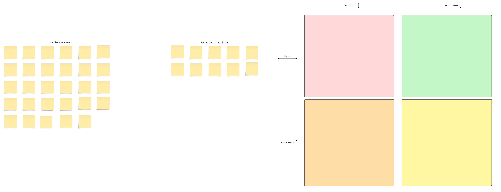

# ***Three Level Scale***

## **Introdução**

&emsp;&emsp;Este artefato apresenta a técnica de priorização conhecida como <b>Three Level Scale (TLS)</b>. O TLS é uma técnica que divide os requisitos em <b>três níveis de prioridade: alta, média e baixa.</b>

&emsp;&emsp;Na técnica TLS, os principais critérios são <b>"importância"</b> e <b>"urgência"</b>, que determinam em qual dos três quadrantes o requisito se encaixa. De acordo com Karl E. Wiegers, os quadrantes são definidos da seguinte forma:

<li>Alta prioridade: Requisitos importantes e urgentes que devem ser implementados o mais rápido possível.</li>
<li>Média prioridade: Requisitos importantes, mas não urgentes.</li>
<li>Baixa prioridade: Requisitos que não são nem importantes, nem urgentes.</li>

## **Objetivo**

&emsp;&emsp;No âmbito deste projeto, o objetivo é aplicar a técnica de priorização Three Level Scale (TLS) aos requisitos já elicitados. Nossa meta principal é classificar esses requisitos em três <b>níveis de prioridade: alta, média e baixa</b>, utilizando os critérios de "importância" e "urgência" estabelecidos por Karl E. Wiegers.

&emsp;&emsp;Através dessa priorização, visamos alcançar os seguintes resultados:

<li><b>Identificar e destacar</b> os requisitos considerados de alta prioridade, ou seja, aqueles que são tanto importantes quanto urgentes para o sucesso do projeto. Esses requisitos serão foco imediato de implementação.</li>

<li><b>Categorizar</b> os requisitos de média prioridade, que são importantes, mas não necessariamente urgentes. Isso nos permitirá planejar sua implementação de acordo com a capacidade e recursos disponíveis.</li>

<li><b>Isolar</b> os requisitos de baixa prioridade, que não são considerados nem importantes, nem urgentes, permitindo-nos revisar sua relevância para o projeto.</li>

<li>Se necessário, realizar uma <b>subpriorização</b> dentro do grupo de alta prioridade para identificar requisitos "Altíssimo", "Muito alto" e "Alto", garantindo que recursos sejam alocados de maneira ainda mais precisa.</li>

&emsp;&emsp;Com a aplicação eficaz da técnica TLS, esperamos obter uma lista de requisitos priorizada que esteja alinhada com as metas de negócios e as necessidades do projeto. Isso facilitará a tomada de decisões informadas sobre a alocação de recursos e o planejamento da implementação, contribuindo para o sucesso geral do projeto de desenvolvimento de software.

## **Metodologia**

&emsp;&emsp;Para realizar a priorização, foram listados todos os requisitos elicitados através das etapas de:
<li>Brainstorming</li>
<li>Entrevista</li>
<li>Introspecção</li>
<li>Observação</li>

&emsp;&emsp;Os participantes empregaram a plataforma LucidChart para efetuar a divisão e a priorização dos requisitos nos respectivos quadrantes, conforme demonstrado e organizado de forma clara na Figura 1.

## **Resultados**
Ao término do processo de priorização, os requisitos foram organizados e dispostos conforme apresentado na Figura 2. 

## **Requisitos de Alta Prioridade**

|identificador|Requisito|Quadrante|
|-------------|---------|---------|
||||

<h6 align = "center"> Tabela 1: Requisitos de Alta Prioridade.
  Autor(a):<a href="https://github.com/Juhvitoria4">Júlia Vitória</a>

</h6>

## **Requisitos de Média Prioridade**
|identificador|Requisito|Quadrante|
|-------------|---------|---------|
||||

<h6 align = "center"> Tabela 1: Requisitos de Media Prioridade.
  Autor(a):<a href="https://github.com/Juhvitoria4">Júlia Vitória</a>

</h6>

## **Requisitos de Baixa Prioridade**
|identificador|Requisito|Quadrante|
|-------------|---------|---------|
||||

<h6 align = "center"> Tabela 1: Requisitos de Baixa Prioridade.
  Autor(a):<a href="https://github.com/Juhvitoria4">Júlia Vitória</a>

</h6>

## **Legenda**

 
<li> RF(Requisitos Funcionais): descrevem as funcionalidades e operações que o sistema deve realizar para atender às necessidades dos usuários. </li>
<li> RNF(Requisitos Não Funcionais): definem a qualidade e o desempenho de um sistema. </li>
<li> Identificação(ENT + N°) : Requisito Elicitado pela Entrevista + Número.
<li> Identificação(BR + N°) : Requisito Elicitado pela Brainstorming + Número
<li> Identificação(IN + N°) : Requisito Elicitado pela Introspecção + Número
<li> Identificação(OB + N°) : Requisito Elicitado pela Observação + Número

## **Histórico de Versão**

&emsp;&emsp;A tabela 2 representa o histórico de versão do documento.

| Versão | Data | Descrição | Autor(es) | Revisor(es) |
| ------ | ---- | --------- | --------- | ---------- |
| `1.0`  | 06/10/2023 | Elaboração do artefato | [Júlia Vitória](https://github.com/Juhvitoria4) |  |
<h6> Tabela 5: Histórico de Versão.
  Autor(a): <a href="https://github.com/Juhvitoria4">Júlia Vitória</a> </h6>

## **Bibliografia**
> <a href="https://requisitos-de-software.github.io/2023.1-Simplenote/elicitacao/Prioriza%C3%A7%C3%A3o/MoScoW/">[1]</a> MoSCoW em Simplenote. Acesso em 04 de Outubro de 2023.

> <a href="https://aprender3.unb.br/pluginfile.php/2692779/mod_resource/content/2/Requisitos%20-%20Aula%2007.pdf">[2]</a> Requisitos - Aula 06. Acesso em 04 de Outubro de 2023.