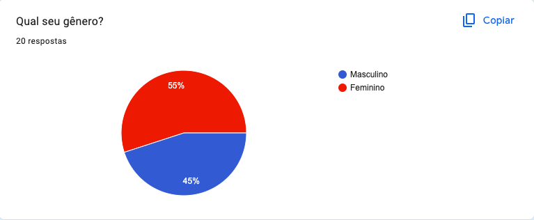
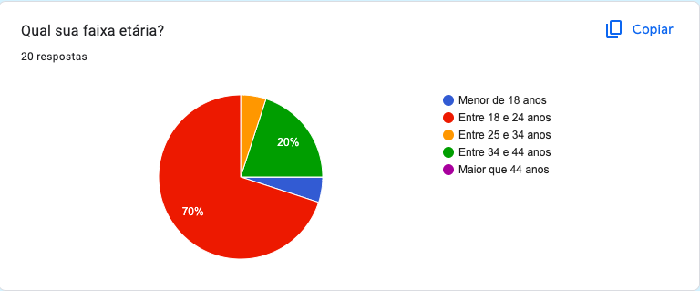
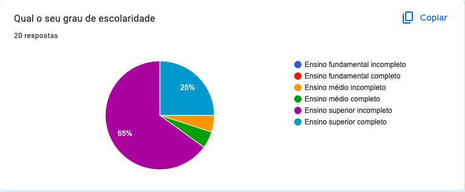
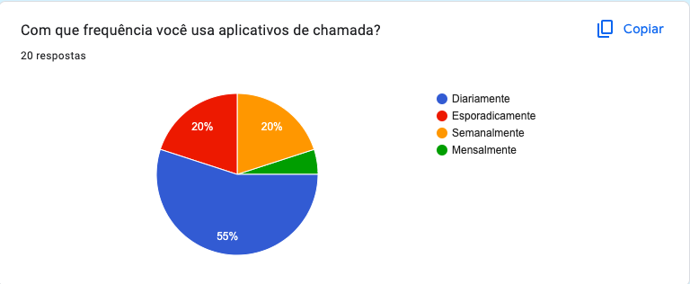

# ***Personas***

## **Introdução**

&emsp;&emsp; Neste documento você encontrará as personas criadas pelo grupo, juntamente com a metodologia empregada para defini-las. Ele oferece uma visão detalhada das personas desenvolvidas, incluindo suas características, motivações e necessidades. Através desse documento, você poderá compreender melhor o público-alvo, permitindo uma abordagem mais direcionada e eficaz para atender às necessidades dos usuários.

## **Metodologia**

&emsp;&emsp; Courage e Baxter, enfatizam a importância de ter um conjunto específico de personas para cada projeto. Recomenda-se ter de 3 a 12 personas. 
Para criar as personas utilizamos a técnica usada para coletar dados <a href="https://requisitos-de-software.github.io/2023.2-Jitsi/Elicita%C3%A7%C3%A3o/questionario/">questionário</a>, que a partir disso conseguimos elaborar o perfil de usuário.
As imagens utilizadas neste documento para reprensentar as personas foram obtidas do site <a href="https://this-person-does-not-exist.com/en">This Person Does Not Exist</a>, que a partir de inteligência artificial gera imagens que não possuem direitos autorais.

## **Resultado do Questionário**

O resultado no questionário teve o total de 20 respostas todas de acordo com o [termo de consentimento](./termo-consentimento-questionario.pdf) e o resultado das respostas são apresentados nas figuras de 1 a 10.

De acordo com a figura 1, o gênero dos participantes em sua maioria é masculino represetando 55% das respostas sendo que o gênero masculino representa os outros 45%.

<figure markdown>

Figura 1 - Questão 1.

Fonte: Bruno Henrique e Catlen.

</figure>

De acordo com o gráfico apresentado na figura 2 em relação a faixa etária dos participantes, a maioria representando 70% dos participantes estão na faixa etária de 18 a 24 anos.

<figure markdown>

Figura 2 - Questão 2.

Fonte: Bruno Henrique e Catlen.

</figure>

De acordo com o gráfico apresentado na figura 3 o grau de escolaridade dos participantes, com 65% o Ensino Superior Incompleto e 25% com o Ensino Superior Completo, ou seja, uma predominância de usuários no ensino superior.

<figure markdown>

Figura 3 - Questão 3.

Fonte: Bruno Henrique e Catlen.

</figure>

De acordo com o gráfico apresentado na figura 4 sobre a frequência que o participante utiliza o aplicativos de chamada, com 55% selecionado a opção diariamente e os outros 20% semanalmente e esporadicamente.

<figure markdown>

Figura 4 - Questão 4.

Fonte: Bruno Henrique e Catlen.

</figure>

## **Perfil de Usuário**

&emsp;&emsp; Perfil de usuário é uma descrição detalhada das características dos usuários cujos objetivos devem ser apoiados pelo sistema sendo projetado (Barbosa, 2021), com base nisso definimos o perfil de usuário primeiro para depois definir as personas.

Perfil de usuário:

<li>É predominantemente usado por pessoas entre 18 e 44 anos</li>
<li>Estudantes do ensino médio e superior, e também concluintes</li>
<li>Tem muita ou media experiencia com dispositivos eletrônicos</li>
<li>Usado principalmente em reuniões para a faculdade</li>

## **Personas**

&emsp;&emsp;

## **Legenda**

<h6 align = "center"> Figura/Tabela n: Nome da figura/tabela.
  Autor(a): <a href="https://github.com/fulanodetal">Fulano de Tal</a></h6>

## **Histórico de Versão**

&emsp;&emsp;A tabela n representa o histórico de versão do documento.

| Versão | Data       | Descrição            | Autor(es)                                                                                                 | Revisor(es)                                 |
|--------|------------|----------------------|-----------------------------------------------------------------------------------------------------------|---------------------------------------------|
| `1.0`  | 03/10/2023 | Criação do Documento | [Bruno Henrique](https://github.com/BrunoHenrique00) e[Carolina Barbosa](https://github.com/CarolinaBarb) | [Catlen Cleane](https://github.com/catlenc) |
<h6> Tabela n: Histórico de Versão.

## **Bibliografia**
> <a href="https://github.com/Requisitos-de-Software/2023.1-BilheteriaDigital/blob/main/docs/planejamento/cronograma.md">[1]</a> Cronograma Bilheteria Digital. Acesso em 02 de Outubro de 2023.

> <a href="https://aprender3.unb.br/pluginfile.php/2692772/mod_resource/content/2/Requisitos%20-%20Aula%2007.pdf">[2]</a> Requisitos - Aula 07. Acesso em 02 de Outubro de 2023.