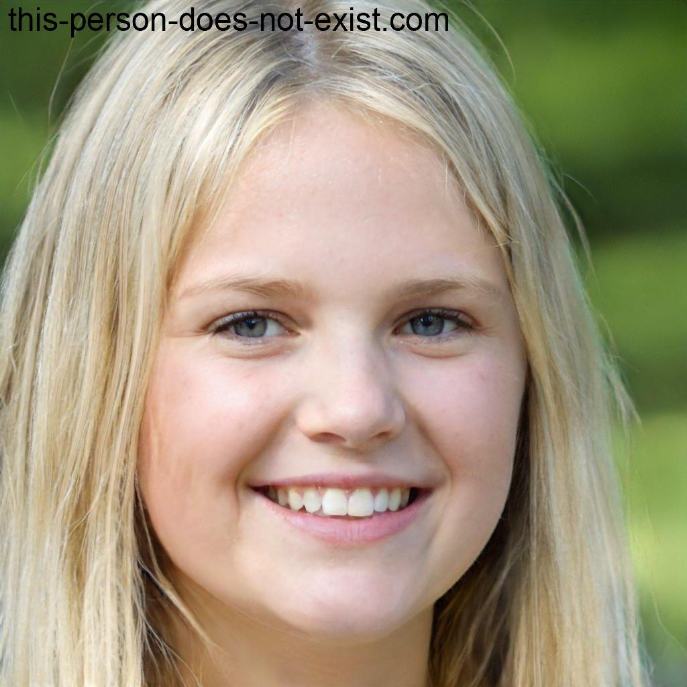
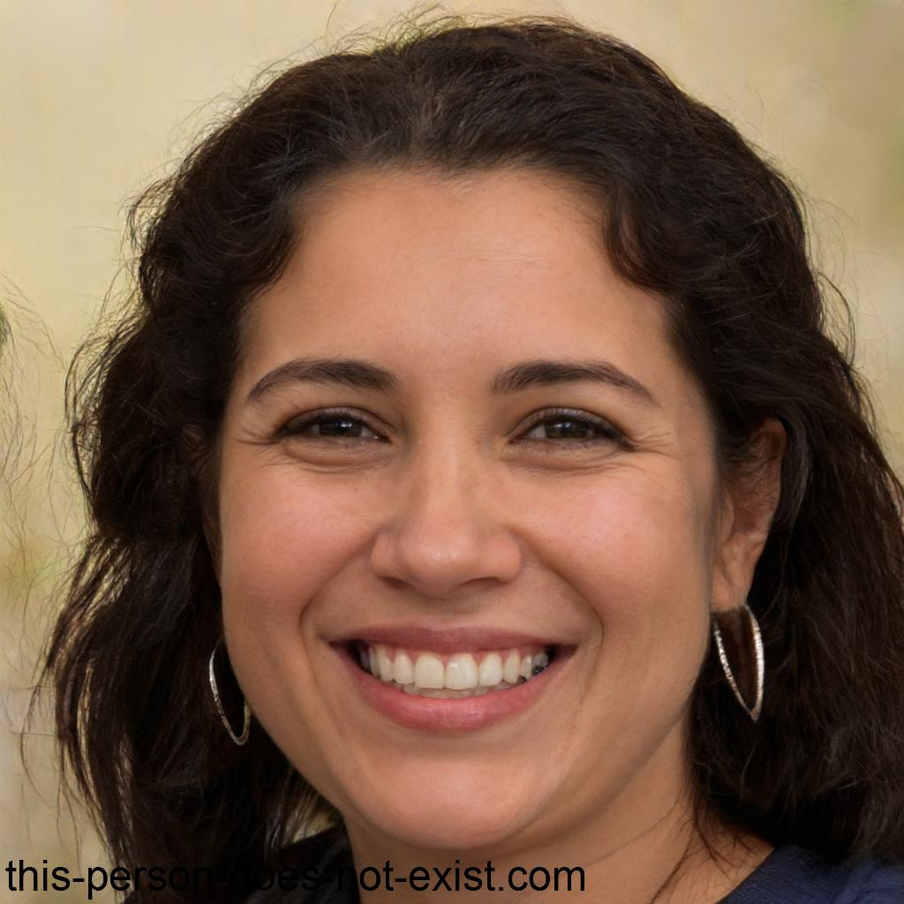
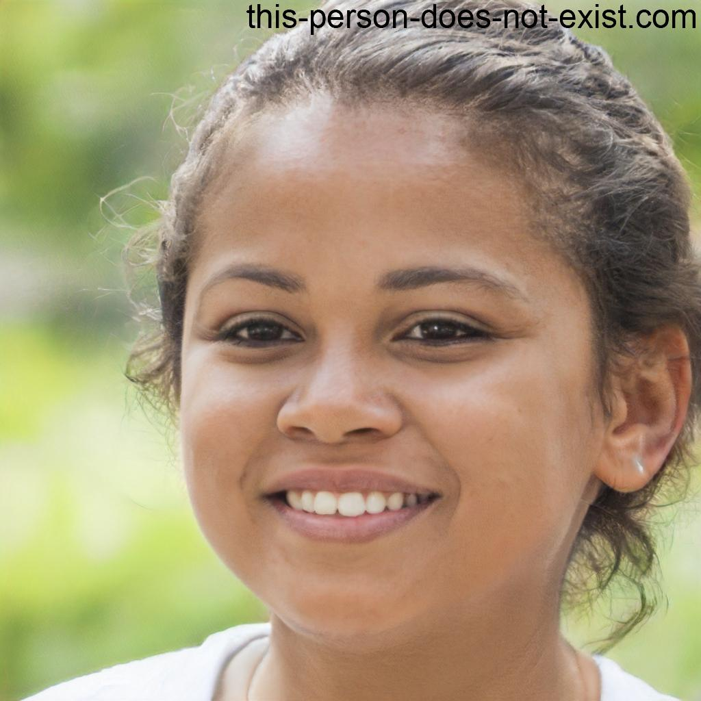

# ***Personas***

## **Introdução**

&emsp;&emsp; Neste documento você encontrará as personas criadas pelo grupo, juntamente com a metodologia empregada para defini-las. Ele oferece uma visão detalhada das personas desenvolvidas, incluindo suas características, motivações e necessidades. Através desse documento, você poderá compreender melhor o público-alvo, permitindo uma abordagem mais direcionada e eficaz para atender às necessidades dos usuários.

## **Metodologia**

&emsp;&emsp; Courage e Baxter, enfatizam a importância de ter um conjunto específico de personas para cada projeto. Recomenda-se ter de 3 a 12 personas. 
Para criar as personas utilizamos a técnica usada para coletar dados <a href="https://requisitos-de-software.github.io/2023.2-Jitsi/Elicita%C3%A7%C3%A3o/questionario/">questionário</a>, que a partir disso conseguimos elaborar o perfil de usuário.
As imagens utilizadas neste documento para reprensentar as personas foram obtidas do site <a href="https://this-person-does-not-exist.com/en">This Person Does Not Exist</a>, que a partir de inteligência artificial gera imagens que não possuem direitos autorais.

## **Perfil de Usuário**

&emsp;&emsp; Perfil de usuário é uma descrição detalhada das características dos usuários cujos objetivos devem ser apoiados pelo sistema sendo projetado (Barbosa, 2021), com base nisso definimos o perfil de usuário primeiro para depois definir as personas.

Perfil de usuário:

<li>É predominantemente usado por pessoas entre 18 e 44 anos</li>
<li>Estudantes do ensino médio e superior, e também concluintes</li>
<li>Tem muita ou media experiencia com dispositivos eletrônicos</li>
<li>Usado principalmente em reuniões para a faculdade</li>

## **Personas**
### Marina

<figcaption align='center'>
    <b>Figura 1: Marina.</b>
     <small>Fonte: <a href='https://this-person-does-not-exist.com/en'>Thispersondoesnotexist</a> </small>
</figcaption>

 

| Caracteristica       | Resposta |
|:---------------------|:---------|
| **Nome**             | Marina   |
| **Idade**            | 23 anos  |
| **Gênero**           | Feminino |
| **Localidade**       |          |
| **Particularidades** |          |
| **Escolaridade**     |          |
| **Profissão**        |          |
| **História**         |          |
| **Objetivos**        |          |
| **Rotina**           |          |
| **Requisitos**       |          |
| **Frequência**       |          |
| **Necessidades**     |          |
| **Expectativas**     |          |

<h6 align = "center"> Figura/Tabela n: Nome da figura/tabela.
  Autor(a): <a href="https://github.com/CarolinaBarb">Carolina Barbosa</a></h6>

### Marcos

<figcaption align='center'>
    <b>Figura 2: Marcos.</b>
     <small>Fonte: <a href='https://this-person-does-not-exist.com/en'>Thispersondoesnotexist</a> </small>
</figcaption>

 

| Caracteristica       | Resposta  |
|:---------------------|:----------|
| **Nome**             | Marcos    |
| **Idade**            | 25        |
| **Gênero**           | Masculino |
| **Localidade**       |           |
| **Particularidades** |           |
| **Escolaridade**     |           |
| **Profissão**        |           |
| **História**         |           |
| **Objetivos**        |           |
| **Rotina**           |           |
| **Requisitos**       |           |
| **Frequência**       |           |
| **Necessidades**     |           |
| **Expectativas**     |           |

<h6 align = "center"> Figura/Tabela n: Nome da figura/tabela.
  Autor(a): <a href="https://github.com/CarolinaBarb">Carolina Barbosa</a></h6>

### Jaqueline

<figcaption align='center'>
    <b>Figura 3: Jaqueline.</b>
     <small>Fonte: <a href='https://this-person-does-not-exist.com/en'>Thispersondoesnotexist</a> </small>
</figcaption>

 

| Caracteristica       | Resposta  |
|:---------------------|:----------|
| **Nome**             | Jaqueline |
| **Idade**            | 38        |
| **Gênero**           | Feminino  |
| **Localidade**       |           |
| **Particularidades** |           |
| **Escolaridade**     |           |
| **Profissão**        |           |
| **História**         |           |
| **Objetivos**        |           |
| **Rotina**           |           |
| **Requisitos**       |           |
| **Frequência**       |           |
| **Necessidades**     |           |
| **Expectativas**     |           |

<h6 align = "center"> Figura/Tabela n: Nome da figura/tabela.
  Autor(a): <a href="https://github.com/CarolinaBarb">Carolina Barbosa</a></h6>

### Joyce

<figcaption align='center'>
    <b>Figura 4: Joyce.</b>
     <small>Fonte: <a href='https://this-person-does-not-exist.com/en'>Thispersondoesnotexist</a> </small>
</figcaption>

 

| Caracteristica       | Resposta |
|:---------------------|:---------|
| **Nome**             | Joyce    |
| **Idade**            | 18       |
| **Gênero**           | Feminino |
| **Localidade**       |          |
| **Particularidades** |          |
| **Escolaridade**     |          |
| **Profissão**        |          |
| **História**         |          |
| **Objetivos**        |          |
| **Rotina**           |          |
| **Requisitos**       |          |
| **Frequência**       |          |
| **Necessidades**     |          |
| **Expectativas**     |          |

<h6 align = "center"> Figura/Tabela n: Nome da figura/tabela.
  Autor(a): <a href="https://github.com/CarolinaBarb">Carolina Barbosa</a></h6>

### Isaque 

<figcaption align='center'>
    <b>Figura 5: Isaque.</b>
     <small>Fonte: <a href='https://this-person-does-not-exist.com/en'>Thispersondoesnotexist</a> </small>
</figcaption>

 

| Caracteristica       | Resposta  |
|:---------------------|:----------|
| **Nome**             | Isaque    |
| **Idade**            |           |
| **Gênero**           | Masculino |
| **Localidade**       |           |
| **Particularidades** |           |
| **Escolaridade**     |           |
| **Profissão**        |           |
| **História**         |           |
| **Objetivos**        |           |
| **Rotina**           |           |
| **Requisitos**       |           |
| **Frequência**       |           |
| **Necessidades**     |           |
| **Expectativas**     |           |

<h6 align = "center"> Figura/Tabela n: Nome da figura/tabela.
  Autor(a): <a href="https://github.com/CarolinaBarb">Carolina Barbosa</a></h6>

## **Histórico de Versão**

&emsp;&emsp;A tabela n representa o histórico de versão do documento.

| Versão | Data       | Descrição            | Autor(es)                                                                                                  | Revisor(es)                                 |
|--------|------------|----------------------|------------------------------------------------------------------------------------------------------------|---------------------------------------------|
| `1.0`  | 03/10/2023 | Criação do Documento | [Bruno Henrique](https://github.com/BrunoHenrique00) e [Carolina Barbosa](https://github.com/CarolinaBarb) | [Catlen Cleane](https://github.com/catlenc) |
| `1.1`  | 03/10/2023 | Iniciando Personas   | [Bruno Henrique](https://github.com/BrunoHenrique00) e [Carolina Barbosa](https://github.com/CarolinaBarb) | [Catlen Cleane](https://github.com/catlenc) |
<h6> Tabela n: Histórico de Versão.
  Autor(a): <a href="https://github.com/CarolinaBarb">Carolina Barbosa</a></h6>

## **Bibliografia**

> [1] Barbosa, S. D. J.; Silva, B. S. da; Silveira, M. S.; Gasparini, I.; Darin, T.; Barbosa, G. D. J. (2021) Interação Humano-Computador e Experiência do usuário. Autopublicação. ISBN: 978-65-00-19677-1.