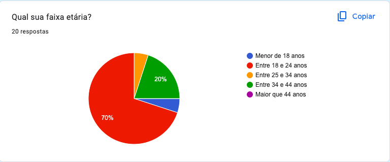
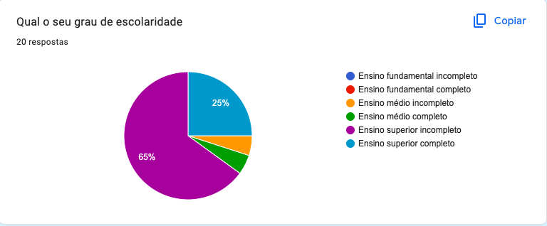
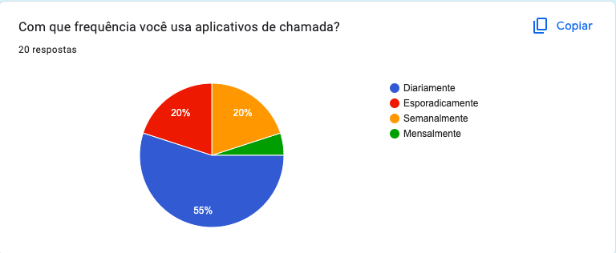

# ***Questionário***

## **Introdução**

&emsp;&emsp;Um questionário é uma técnica comum utilizada para a elicitação de requisitos, que envolve a criação de um conjunto de perguntas com o objetivo de coletar informações sobre as necessidades e expectativas de um grupo de pessoas. Ao utilizar um questionário, é possível obter dados de um grande número de pessoas de forma rápida e eficiente. Analisando as respostas dos questionários, é possível identificar padrões, tendências e preferências das partes interessadas, o que pode ajudar na tomada de decisões e no desenvolvimento de soluções que atendam às necessidades do projeto.

## **Metodologia**

&emsp;&emsp;O questionário foi divulgado em grupos de WhatsApp, nos grupos da Unb, familia .... desenvolver

## **Resultados**

&emsp;&emsp; Os dados que o grupo coletou foram por meio de um questionário online. O questionário obteve 20 respostas todas de acordo com o <a href="https://docs.google.com/document/d/1fmuMpkPT43gpluq_j9xrKqiJx61ifFlCeK5ZwiqAOsg/edit">termo de consentimento</a> no período em que ficou disponível (entre 29/09/23 e 02/10/23) e apresentava 9 perguntas, e o resultado das respostas são apresentados nas figuras de 1 a 9.

<figure markdown>

Figura 1 - Questão 1.

Autor(es): <a href="https://github.com/BrunoHenrique00">Bruno Henrique</a> e <a href="https://github.com/CarolinaBarb">Carolina Barbosa</a>

</figure>

<figure markdown>

Figura 2 - Questão 2.

Autor(es): <a href="https://github.com/BrunoHenrique00">Bruno Henrique</a> e <a href="https://github.com/CarolinaBarb">Carolina Barbosa</a>

</figure>

<figure markdown>

Figura 3 - Questão 3.

Autor(es): <a href="https://github.com/BrunoHenrique00">Bruno Henrique</a> e <a href="https://github.com/CarolinaBarb">Carolina Barbosa</a>

</figure>

<figure markdown>

Figura 4 - Questão 4.

Autor(es): <a href="https://github.com/BrunoHenrique00">Bruno Henrique</a> e <a href="https://github.com/CarolinaBarb">Carolina Barbosa</a>

</figure>

<figure markdown>

Figura 5 - Questão 5.

Autor(es): <a href="https://github.com/BrunoHenrique00">Bruno Henrique</a> e <a href="https://github.com/CarolinaBarb">Carolina Barbosa</a>

</figure>

<figure markdown>

Figura 6 - Questão 6.

Autor(es): <a href="https://github.com/BrunoHenrique00">Bruno Henrique</a> e <a href="https://github.com/CarolinaBarb">Carolina Barbosa</a>

</figure>

<figure markdown>

Figura 7 - Questão 7.

Autor(es): <a href="https://github.com/BrunoHenrique00">Bruno Henrique</a> e <a href="https://github.com/CarolinaBarb">Carolina Barbosa</a>

</figure>

<figure markdown>

Figura 8 - Questão 8.

Autor(es): <a href="https://github.com/BrunoHenrique00">Bruno Henrique</a> e <a href="https://github.com/CarolinaBarb">Carolina Barbosa</a>

</figure>

<figure markdown>

Figura 9 - Questão 9.

 Autor(es): <a href="https://github.com/BrunoHenrique00">Bruno Henrique</a> e <a href="https://github.com/CarolinaBarb">Carolina Barbosa</a>
</figure>

## **Histórico de Versão**

&emsp;&emsp;A tabela n representa o histórico de versão do documento.

| Versão | Data | Descrição | Autor(es) | Revisor(es) |
| ------ | ---- | --------- | --------- | ---------- |
| `1.0`  | 03/10/2023 | Criação do Documento  | [Bruno Henrique](https://github.com/BrunoHenrique00) e [Carolina Barbosa](https://github.com/CarolinaBarb) | [Catlen Cleane](https://github.com/catlenc) |
<h6> Tabela n: Histórico de Versão.

## **Bibliografia**
> <a href="https://Link_da_fonte">[1]</a> Fonte 1

> <a href="https://Link_da_fonte">[2]</a> Fonte 2