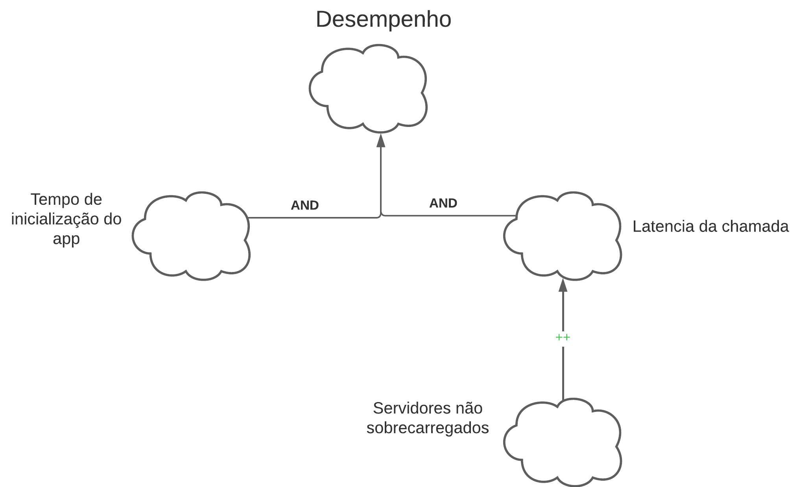
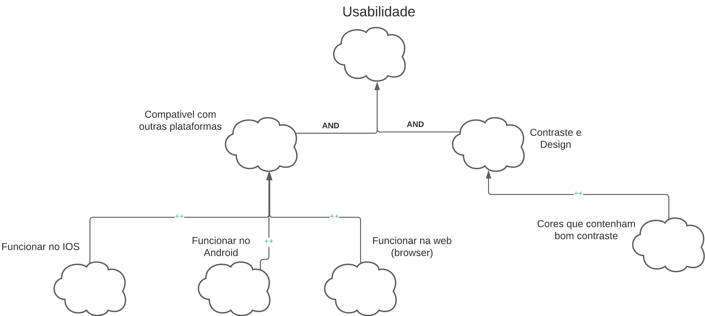
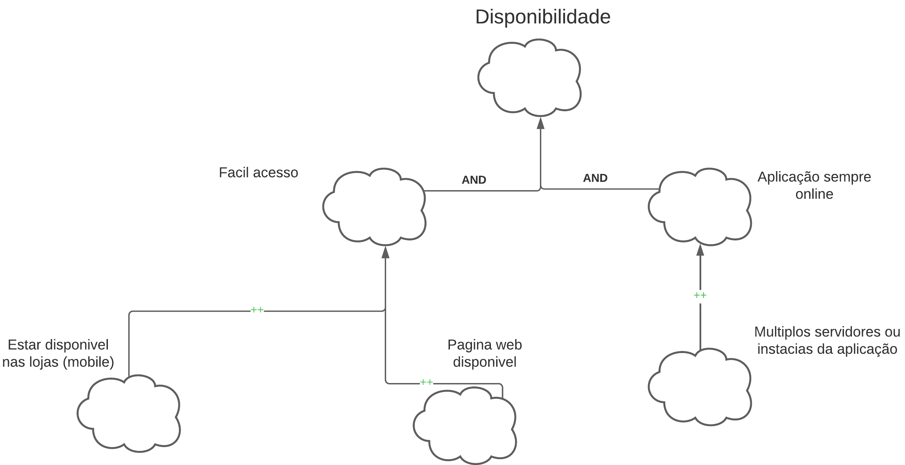

# ***NFR Framework***

## **Introdução**

&emsp;&emsp;Proposto por Chung, University of Toronto, o NFR Framework é uma maneira de representar de forma sistemática e global os Requisitos Não-Funcionais, com uma abordagem qualitativa e orientada a processo. Seu objetivo é ajudar os desenvolvedores a implementar soluções customizadas, levando em consideração as características dos campos e sistemas relacionados. Essas características incluem requisitos não funcionais, requisitos funcionais, prioridades e cargas de trabalho. Essas condições determinam a escolha de alternativas de desenvolvimento para um determinado sistema. 

&emsp;&emsp;Além disso, essa implementação representa o NFR como um softgoal, os quais são unidades básicas para representar requisitos não-funcionais. Ele possui uma relação de interdependência entre seus softgoals, oferece técnicas de operacionalização e fornece catálogos para inferir possíveis interações. 

## **Metodologia**

&emsp;&emsp;Após levantar os Requisitos Não-Funcionais e entender o NFR Framework, o grupo decidiu utilizar Softgoal Interdependency Graph (SIG) para a implementação do NFR Framework. 

## **Softgoal Interdependency Graph**

&emsp;&emsp;O Softgoal Interdependency Graph (SIG) é uma forma de visualização do funcionamento do NFR Framework. Dessa forma, trata-se de um gráfico que registra os posicionamentos da equipe de desenvolvimento acerca dos softgoals e explicita suas interdependências de forma gráfica e concisa1.

Imagem 1: Legenda do NFR.

    

Fonte: NFR4ES: Um Catálogo de Requisitos Não-Funcionais para Sistemas Embarcados por Reinaldo Antônio da Silva.

Imagem 2: Tipos de rótulos utilizados pelos Softgoals.

Fonte: NFR4ES: Um Catálogo de Requisitos Não-Funcionais para Sistemas Embarcados por Reinaldo Antônio da Silva.

## **Requisitos Não Funcionais**

&emsp;&emsp;A tabela 1 apresenta os Requisitos Não Funcionais.

| Identificador | Requisito | Categoria | Implementado | 
| ------------- | -------------------- | --------- | ------- | 
| [ENT08](/Elicitacao/tecnicas/entrevista/#requisitos-elicitados), [OB17](/Elicitacao/tecnicas/observacao/#requisitos-elicitados), [BR17](/Elicitacao/tecnicas/brainstorming/#requisitos-elicitados) | Deve ter uma interface clara e intuitiva, permitindo que o usuário consiga realizar qualquer atividade com menos de 5 cliques | RNF01 | Sim |
| [IN05](/Elicitacao/tecnicas/introspec%C3%A7%C3%A3o/#requisitos-elicitados) | Ser compatível com sistemas operacionais Android e IOS | RNF02 | Sim | 
| [IN06](/Elicitacao/tecnicas/introspec%C3%A7%C3%A3o/#requisitos-elicitados) | Deve ter acesso facilitado para instalação, sem levar mais de 30 segundos de pesquisa direta para encontrar a aplicação nas lojas de aplicativos | RNF03 | Sim | 
| [IN07](/Elicitacao/tecnicas/introspec%C3%A7%C3%A3o/#requisitos-elicitados) | Deve ser de código aberto e gratuito | RNF04 | Sim | 
| [IN11](/Elicitacao/tecnicas/introspec%C3%A7%C3%A3o/#requisitos-elicitados), [OB12](/Elicitacao/tecnicas/observacao/#requisitos-elicitados)| Deve garantir a segurança dos dados confidenciais compartilhados durante as reuniões por vídeoconferência | RNF05 | Sim |
| [IN12](/Elicitacao/tecnicas/introspec%C3%A7%C3%A3o/#requisitos-elicitados) | Deve ser estável, tendo no máximo 1 queda de funcionamento por dia | RNF06 | Sim |
| [IN13](/Elicitacao/tecnicas/introspec%C3%A7%C3%A3o/#requisitos-elicitados) | Deve oferecer um desempenho responsivo, se adaptando mediante o tamanho da tela  | RNF07 | Sim | 
| [OB16](/Elicitacao/tecnicas/observacao/#requisitos-elicitados) | Deve ser um aplicativo que ocupe menos de 100mb de memória | RNF08 | Sim |
| [BR12](/Elicitacao/tecnicas/brainstorming/#requisitos-elicitados) | Deve ser possível ingressar em uma reunião sem a necessidade de um login | RNF09 | Sim | 
| [BR18](/Elicitacao/tecnicas/brainstorming/#requisitos-elicitados) | Deve possuir um bom contraste entre as cores a fim de aprimorar a legibilidade | RNF10 | Sim |
<h6 align = "center"> Tabela 1: Requisitos Não Funcionais Elicitados.
  Autor(a): <a href="https://github.com/BrunoHenrique00">Bruno Henrique</a></h6>

### **NFR 01 - Desempenho**

<b>Figura 1</b> - SIG Desempenho

 Fonte: [Bruno Henrique](https://github.com/BrunoHenrique00)

### **NFR 02 - Usabilidade**

&emsp;&emsp;Os Requisitos utilizados para a confecção da Figura 2 estão presentes na Tabela 1:

- <a id="anchor_NF02">IN05</a>: Ser compatível com sistemas operacionais Android e IOS
- <a id="anchor_NF03" >IN13</a>: Deve oferecer um desempenho responsivo, se adaptando mediante o tamanho da tela
- <a id="anchor_NF04">BR18</a>: Deve possuir um bom contraste entre as cores a fim de aprimorar a legibilidade

<b>Figura 2</b> - SIG Usabilidade

 Fonte: [Bruno Henrique](https://github.com/BrunoHenrique00)

### **NFR 03 - Disponibilidade**

&emsp;&emsp;Os Requisitos utilizados para a confecção da Figura 3 estão presentes na Tabela 1:

- <a id="anchor_NF03" href="#NF03">IN06</a>: Deve ter acesso facilitado para instalação, sem levar mais de 30 segundos de pesquisa direta para encontrar a aplicação nas lojas de aplicativos
- <a id="anchor_NF04" href="#NF04">IN12</a>: Deve ser estável, tendo no máximo 1 queda de funcionamento por dia
- <a id="anchor_NF04" href="#NF04">OB16</a>: Deve ser um aplicativo que ocupe menos de 100mb de memória

<b>Figura 3</b> - SIG Disponibilidadde

 Fonte: [Bruno Henrique](https://github.com/BrunoHenrique00)

## **Histórico de Versão**

&emsp;&emsp;A tabela 2 representa o histórico de versão do documento.

| Versão | Data       | Descrição                                    | Autor(es)                                        | Revisor(es)                                      |
| ------ | ---------- | -------------------------------------------- | ------------------------------------------------ | ------------------------------------------------ |
| `1.0`  | 06/11/2023 | Introdução, SIG, Tipos de Softgoal e Interdependências.| [Bruno Henrique](https://github.com/BrunoHenrique00)   | [Pedro Siqueira](https://github.com/PedroSiq) |
| `1.1`  | 07/11/2023 | Formatação e finalização do artefato | [Pedro Siqueira](https://github.com/PedroSiq) | [Bruno Henrique](https://github.com/BrunoHenrique00) |

## **Bibliografia**

> PAIM, F. R. S., CASTRO, J. F. B. Enhancing Data Warehouse Design with the NFR Framework. Centro de Informática UFPE, Recife, 2019. Disponível em: <http://wer.inf.puc-rio.br/WERpapers/artigos/artigos_WER02/paim.pdf>. Acesso em: 05/11/2023.

> <a id="REF1" href="#anchor_1">1.</a> SILVA, Reinaldo Antônio. NFR4ES: Um Catálogo de Requisitos Não-Funcionais para Sistemas Embarcados. Centro de Informática UFPE, Recife, 2019. Disponível em: <https://repositorio.ufpe.br/handle/123456789/34150>. Acesso em: 05/11/2023.

> <a id="REF2" href="#anchor_2">2.</a>CHUNG, L., NIXON, B. A., YU, E., MYLOPOULOS, J. Non-functional requirementsin software engineering. Springer Science & Business Media: [S.l.], 2000. v. 5.