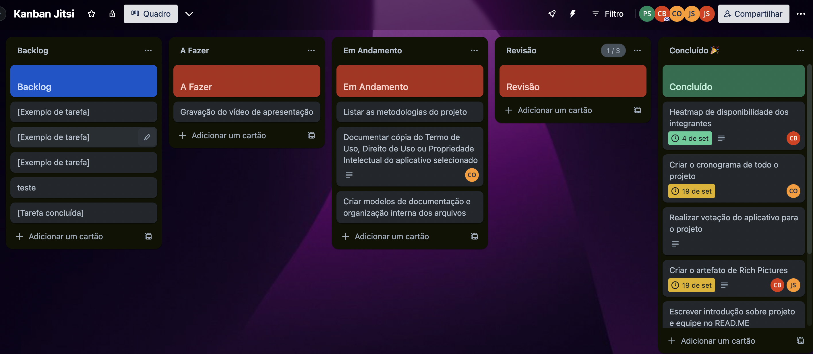

# ***Metodologias***

## **Introdução**
<p align="justify">
&emsp;&emsp;Metodologia é o <b>estudo dos caminhos para se chegar a um determinado fim</b>. No presente artefato estão listadas as <b>metodologias</b>, <b>métodos</b>, <b><i>frameworks</i></b> e <b>políticas</b> que serão utilizadas pela equipe no projeto, a fim de atingir os objetivos do mesmo e agilizar todo o processo de desenvolvimento. 
</p>

## **Kanban**
<p align="justify">
&emsp;&emsp;O Kanban é um <b>método de gerenciamento de fluxo de trabalho</b> que tem como objetivo auxiliar a equipe de desenvolvimento a gerenciar e melhorar os sistemas de trabalho. Será implementado através da plataforma Trello, por meio de um quadro com os campos Backlog, A Fazer, Em Andamento, Revisão e Concluído. Todas as atividades serão listadas no <b>Backlog</b>, que se trata da lista de pendências do projeto, e posteriormente alocadas para os campos seguintes no <b>início</b> das atividades semanais.
</p>
<p align="justify">
&emsp;&emsp;A figura 1 demonstra o quadro confeccionado pela equipe.
</p>
<center>
 
</center>
<h6 align = "center"> Figura 1: Quadro do Trello.
<br> Autor(a): <a href="github.com/PedroSiq">Pedro Siqueira</a> </h6>

## **Atividades em Pares**
<p align="justify">
&emsp;&emsp;Visando priorizar a <b>qualidade</b> dos artefatos entregues ao decorrer do projeto, todas as atividades devem ser desenvolvidas por pelo menos <b>dois</b> membros, sendo um deles o <b>autor</b> do artefato e o outro, o <b>revisor</b>. Tais atividades podem ser realizadas de maneira <b>síncrona</b> ou <b>assíncrona</b>. 
</p>
<p align="justify">
&emsp;&emsp;Também há a possibilidade, em caso de necessidade, de expandir o escopo de membros autores para dois, configurando <b>três membros</b> envolvidos na atividade, dois autores e um revisor.
</p>
<p align="justify">
&emsp;&emsp;Atividades nas quais pelo menos <b>três membros</b>, por qualquer motivo, estejam designados para o seu desenvolvimento não dependem de um revisor.
</p>

## **Políticas**
<p align="justify">
&emsp;&emsp;Políticas de documentação que visam padronizar as entregas e facilitar a comunicação e organização interna. <b>Tipos</b> de <b><i>branches</i></b> e <b><i>commits</i></b> são: <b>doc</b> (em caso de documentação) e <b>fix</b> (em caso de correção de erros).
</p>

### **Política de _Branches_**
<p align="justify">
&emsp;&emsp;Para auxiliar no desenvolvimento de uma atividade, o integrante responsável deve criar uma <b><i>branch</i></b> (ramificação) para prosseguir o trabalho. Para isso, deve-se executar o seguinte comando:
</p>

```git
git checkout -b [tipo]/nome_da_branch
```
### **Política de _Commits_**
<p align="justify">
&emsp;&emsp;Ao realizar alterações em artefatos, o integrante responsável realizará <b><i>commits</b></i> para salvá-las. Após isso, deve-se efetuar o envio de tais alterações, seguindo o fluxo abaixo: 
</p>

```git
git commit -m "[tipo]:mudanças_realizadas"
git push origin [tipo]/nome_da_branch
```

## **Histórico de Versão**
<p align="justify">
&emsp;&emsp;A tabela 1 representa o histórico de versão do documento.
</p>

| Versão | Data | Descrição | Autor(es) | Revisor(es) |
| ------ | ---- | --------- | --------- | ---------- |
| `1.0`  | 19/09/2023 | Criação do documento | [Pedro Siqueira](https://github.com/PedroSiq) | [Catlen Cleane](https://github.com/catlenc) |
| `1.1`  | 20/09/2023 | Acréscimo de políticas e atividades em pares | [Pedro Siqueira](https://github.com/PedroSiq) | [Catlen Cleane](https://github.com/catlenc)|

<center>
<h6> Tabela 1: Histórico de Versão.
<br> Autor(a): <a href="https://github.com/PedroSiq">Pedro Siqueira</a> </h6>
</center>

## **Bibliografia**
> [1] Trello. Disponível em: https://trello.com . Acesso em: 19 de setembro de 2023.

> [2] Kanban: o que é, o Método Kanban, principais conceitos e como funciona no dia a dia. Disponível em: https://www.alura.com.br/artigos/metodo-kanban. Acesso em: 19 de setembro de 2023.