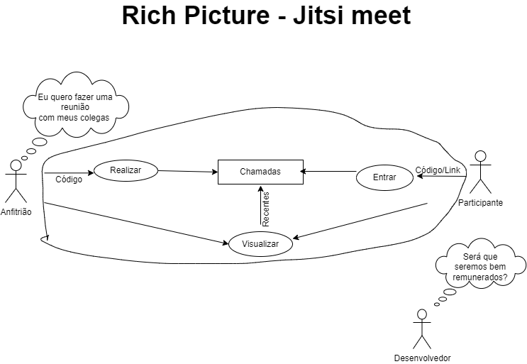

# Rich Picture
<justify> O Rich Picture é uma ferramenta que utiliza imagens e desenhos para expressar as principais características de um sistema. O Rich Picture facilita o entendimento dos problemas e ajuda na busca por soluções. Na engenharia de software utilizamos essa ferramenta com os seguintes elementos para ajudar na representação do sistema: atores, processos, armazenamento de dados, setas e limites do sistema. </justify>

## Metodologia e Ferramentas

Para criar o rich picture, utilizamos a ferramenta draw.io. Inicialmente, realizamos uma análise do aplicativo e suas funcionalidades principais. Em seguida, começamos a representar essas funcionalidades e suas conexões com o usuário e outros elementos do sistema. Além disso, destacamos as operações executadas pelo usuário no aplicativo.

### Figura 1: Rich Picture versão 1

Figura 1: Rich Picture versão 1.0 

 Figura 1 Fonte: Carolina e Julia - Setembro/2023
 

### Legenda 

| Icone | Descrição |
| ------- | ----------- |
|  | Usuários do sistema. |
|  | Ações a serem realizadas no sistema. |
|  | Fluxo de informações. |
|  | Onde o sistema armazena dados. |
|  | Fronteira do sistema, tudo o que o sistema deve cuidar fica dentro da frontreira. |

## Referência

Benyon, D. (2011). Interação Humano-Computador. São Paulo: Pearson Prentice Hall. (2ª edição).

SERRANO, Maurício; DO PRADO LEITE, Julio Cesar Sampaio. A rich traceability model for social interactions. In: Proceedings of the 6th International Workshop on Traceability in Emerging Forms of Software Engineering. 2011. p. 63-66.

## Histórico de Versões

Versão  |   Data   | Descrição | Autor(es) | Revisor(es)
--------- | ------ | ------ | ---------- | ----------
 `1.0` | 18/09/2023 | Criação do documento e Rich Picture | [Carolina Barbosa](https://github.com/CarolinaBarb) e [Julia Sant'Anna](https://github.com/JuliaSSouza)| [Bruno Henrique](https://github.com/BrunoHenrique00)